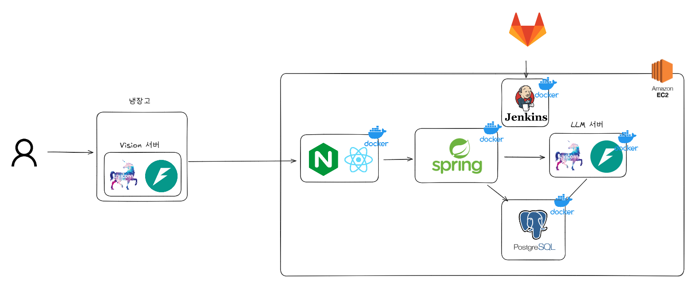

# 🎯 얼굴 인식 AI와 LLM을 활용한 가족별 개인화 푸드 코칭 서비스 **SEE-Through**

---

## ✅프로젝트 진행 기간

2025.02.24 ~ 2025.04.11(7주)

---

## 🚩 서비스 한줄 소개

얼굴 인식 AI와 LLM을 활용한 가족별 개인화 푸드 코칭 서비스

---

## 📌 프로젝트 개요

SSAFY에서 인원을 선발하여 진행한 삼성 전자 DA 사업부 연계 프로젝트입니다.
SEE-Through는 삼성 BESPOKE 패밀리 허브 냉장고를 기반으로 개인화 푸드 코칭을 하는 서비스입니다.
Vision AI 기술을 사용해서 구성원을 식별하고 LLM과 RAG를 활용하여 적절한 코멘트를 제공합니다. BESPOKE 냉장고에 탑재된 AI Vision Inside 기능으로 식재료의 입출고 정보를 받을 수 있습니다. 해당 정보를 바탕으로 어떤 사용자가 입출고를 했는지를 인식하고, 인식한 결과에 따라 개인화된 서비스를 제공합니다.

---

## 🌱 프로젝트 설명 및 목표

현대 가족들은 다양한 식습관과 건강 상태를 가지고 있으며, 냉장고 사용자 또한 각기 다른 니즈를 가집니다.  
SEE-Through는 이런 문제를 해결하기 위해, **얼굴 인식을 통한 사용자 식별**과 **LLM 기반의 자연어 처리 기술**을 결합해  
사용자 맞춤형 푸드 코칭 서비스를 제공합니다.

이를 통해 다음과 같은 목표를 달성하고자 합니다:

- 사용자의 식습관 개선을 위한 코멘트 자동 제공
- 건강 정보 기반의 식재료 주의 알림
- 가족 구성원별 맞춤 식단 생성 및 관리

## 🛠️ 기술 스택

### **Front-End**

- React + TypeScript

### **Back-End**

- Spring Boot + Gradle, FastAPI + Uvicorn

### **Android App**

- Android Studio

### **Database & Cache**

- PostgreSQL

### **Infrastructure & DevOps**

- Docker, Jenkins, AWS EC2, Nginx

---

## 🚀 주요 기능

시연 시나리오에 따른 기능별 이미지 장면은 exec 폴더 안의 시연시나리오 pdf 문서를 참조하시길 바랍니다.

#### 1. 냉장고 사용자 인식

- DeepFace 오픈소스를 기반으로 사용자 인식을 진행했습니다.
- RetinaFace 모델로 Face Detection을 진행했고, Facenet512 모델로 Face Recognition을 진행했습니다.
- 프론트에서는 MediaPipe로 얼굴의 측면과 정면 여부, 냉장고와의 거리, IOU 계산을 활용한 움직임 정도를 파악했습니다.

#### 2. 식재료 출고시 맞춤형 코멘트

- 사용자의 건강상태와 알러지 정보를 반영하여 출고한 식재료에 대한 코멘트를 알려줍니다.
- LLM과 질병관리청 DB를 바탕으로 한 RAG로 사용자가 위험할때 알림을 보냅니다.
- Open AI의 GPT API를 활용한 LangChain AI Agent를 통해 코멘트를 생성합니다.

#### 3. 개인 맞춤형 식단 제작

- 냉장고 안의 식재료와 사용자의 선호/비선호 음식을 바탕으로 맞춤형 식단을 생성합니다.
- LLM과 사용자별 입출고 로그를 기반으로 식단을 생성합니다.
- 생성된 식단을 보고 각 메뉴별 선호/비선호 버튼을 통해 즉각 정보를 갱신하며 다시 식단 생성이 가능합니다.

#### 4. 안드로이드 앱을 활용한 모니터링

- 특정 사용자의 식재료 입출고를 실시간으로 모니터링 할 수 있습니다.
- 원하는 모니터링 대상을 지정하면 휴대폰 어플을 통해 입출고 알림을 받아볼 수 있습니다.
- 원래는 삼성 SmartThings로 개발했으나, 업데이트 이후 개발 문서의 최신화가 되지 않아서 안드로이드 어플로 개발했습니다.

## 🌐 시스템 아키텍처

---

## 📌 팀 구성원

#### 김종헌 (팀장)

- Spring 백엔드 서버 개발

#### 김다정

- LLM과 RAG를 활용한 백엔드 서버 개발
- 개인별 맞춤 푸드 코칭 코멘트 생성

#### 김정우

- 얼굴 인식 AI 백엔드 서버 개발
- DeepFace 기반으로 Face Identification 구현

#### 방민규

- Android 앱 개발

#### 홍권

- 서비스 시뮬레이션 웹 페이지 개발
- 전반적인 인프라와 Jenkins CI/CD 담당
